# MVP de Engenharia de Dados — Auditoria de Postura de Segurança da Plataforma Pitaia

**Vanessa Ribeiro** · Pós-graduação PUC-Rio · Sprint de Engenharia de Dados

> Pipeline de dados em nuvem que coleta o catálogo de segurança de uma plataforma de
> saúde em produção, modela os achados em esquema estrela e entrega um **backlog de
> remediação priorizado por risco regulatório**.

| | |
|---|---|
| **Plataforma de nuvem** | Databricks Free Edition — serverless, Unity Catalog, Delta Lake |
| **Arquitetura** | Medalhão: Bronze → Silver → Gold |
| **Fonte** | Catálogo do PostgreSQL do projeto Supabase da plataforma Pitaia (apitaia.com) |
| **Snapshot** | 26 de setembro de 2026 |
| **Referenciais** | OWASP Top 10:2025 · LGPD Lei 13.709/2018, arts. 5º, 11 e 46 |

```
extracao/00_queries_supabase.sql        8 extrações via SQL Editor do Supabase
notebooks/01_bronze_ingestao.py         CSV → Delta, sem transformação
notebooks/02_silver_qualidade.py        perfil de qualidade, tipagem, classificação LGPD
notebooks/03_gold_regras_modelagem.py   18 regras + esquema estrela + catálogo
notebooks/04_analise_perguntas.sql      as 8 perguntas de negócio
notebooks/05_visualizacoes.py           painel de indicadores + 4 figuras
apresentacao/*.ipynb                    os mesmos notebooks exportados com as saídas
docs/governanca_anonimizacao.md         decisões de privacidade do próprio trabalho
docs/catalogo_de_dados.md               catálogo de dados transcrito
evidencias/                             23 screenshots e figuras da execução
```

> Os arquivos em `apresentacao/` são **exportações dos notebooks executados no Databricks
> Free Edition**, incluídas para que as saídas possam ser lidas diretamente no GitHub, que
> renderiza `.ipynb` de forma nativa. O pipeline não foi executado em Google Colab — toda a
> execução ocorreu na plataforma de nuvem, conforme o item 2 do enunciado.

---

## Contexto de Negócios e Perguntas (Etapas 2 e 4.1)

### O contexto

O **Pitaia** (apitaia.com) é um sistema de inteligência de saúde pessoal. Ele consolida,
num só lugar, dados que hoje vivem espalhados: histórico clínico, exames, medicações,
informações pessoais e métricas corporais. O acesso é compartilhado por três perfis
distintos — **o próprio usuário, médicos e educadores físicos** — cada um devendo alcançar
apenas a fração de informação pertinente ao seu papel.

Essa arquitetura de acesso é o que torna a plataforma útil e, ao mesmo tempo, o que
concentra seu risco. Prontuário é **dado pessoal sensível** na definição do art. 5º, II da
LGPD; seu tratamento exige base legal específica (art. 11) e medidas de segurança
proporcionais ao risco (art. 46). Um defeito de isolamento entre pacientes aqui não é
dívida técnica: é incidente de dados sensíveis.

O Pitaia foi construído com apoio de geração assistida de código sobre Supabase. Esse modo
de construção acelera a entrega, mas desloca as decisões de segurança — sobretudo as
políticas de *Row Level Security* — para configuração implícita, distribuída entre
migrações e raramente auditada de forma sistemática. O resultado típico é uma aplicação
que funciona e cuja postura de segurança ninguém mediu.

### O problema

> **Medir a postura de segurança e a superfície de exposição de dados de saúde da
> plataforma Pitaia, transformando o catálogo do banco em um backlog de remediação
> priorizado por risco — em vez de uma lista desordenada de alertas.**

A decisão de negócio que o pipeline precisa sustentar é concreta: *o que corrigir primeiro,
com tempo limitado de desenvolvimento.*

### As perguntas de negócio

| # | Pergunta | Respondida? |
|---|---|---|
| **P1** | Que proporção das tabelas expostas via API está sem RLS? | ✅ Sim |
| **P2** | Quantas tabelas têm RLS habilitado mas **zero políticas** — protegidas na aparência, quebradas na prática? | ✅ Sim |
| **P3** | Das políticas existentes, quantas isolam de fato por usuário ou tenant? | ✅ Sim |
| **P4** | O que a role anônima consegue **escrever**? | ✅ Sim |
| **P5** | Onde o risco está concentrado — qual schema tem a pior densidade de achados? | ✅ Sim |
| **P6** | Como os achados se distribuem pelas categorias do OWASP Top 10:2025? | ✅ Sim |
| **P7** | **Quantas colunas com dado de saúde estão sem proteção de linha?** (conformidade LGPD art. 11) | ✅ Sim |
| **P8** | **Um usuário autenticado qualquer consegue ler o prontuário de outro paciente?** | ✅ Sim |

P7 e P8 são as perguntas-âncora: as duas que um titular de dados faria se pudesse.
Conforme o enunciado, nenhuma pergunta foi removida — o que não foi respondido está
discutido na Autoavaliação.

### Estrutura dos dados brutos

Oito extrações do catálogo do PostgreSQL. **Nenhum dado de paciente foi coletado** —
somente metadados de estrutura e permissão.

Três das oito consultas foram reescritas durante a coleta. As versões iniciais usavam
`information_schema`, cujas views são **filtradas por privilégio**: só retornam o que a role
de execução enxerga. Na prática isso devolveu 164 linhas de grants — todas de uma única role
de sandbox — em vez da ACL real do banco, o que zeraria silenciosamente as regras de
privilégio anônimo. As versões finais leem `pg_attribute`, `aclexplode(pg_class.relacl)` e
`pg_constraint`, que não sofrem esse filtro. Está registrado aqui porque é uma armadilha
real de coleta, não um detalhe de implementação: a consulta *funcionava* e devolvia dados
plausíveis — só que incompletos.

| Arquivo | Origem no PostgreSQL | Granularidade | Linhas |
|---|---|---|---|
| `objetos.csv` | `pg_class` + `pg_namespace` | 1 por objeto do banco | 344 |
| `politicas.csv` | `pg_policies` | 1 por política de RLS | 209 |
| `colunas.csv` | `pg_attribute` | 1 por coluna | 3.311 |
| `grants.csv` | `aclexplode(pg_class.relacl)` | 1 por role × objeto × privilégio | 5.707 |
| `funcoes.csv` | `pg_proc` (somente flags) | 1 por função | 195 |
| `buckets.csv` | `storage.buckets` | 1 por bucket de Storage | 7 |
| `extensoes.csv` | `pg_extension` | 1 por extensão instalada | 8 |
| `constraints.csv` | `pg_constraint` | 1 por constraint | 380 |

### Licença e base legal dos dados

Os dados **não vêm de repositório público** e portanto não estão sob licença de terceiros.
São **metadados proprietários** da plataforma Pitaia, de minha autoria e propriedade,
extraídos por mim na condição de titular do projeto Supabase. Não há restrição de terceiros
ao seu uso acadêmico.

O que exigiu decisão explícita foi o oposto: como publicar sem criar risco. O enunciado
determina, no item 4.2, anonimizar informações sensíveis ao usar dados empresariais reais.
Quatro medidas foram aplicadas:

1. **Nenhum dado de paciente foi ingerido.** A auditoria opera sobre a *estrutura* do banco.
   `auth.users` e todas as tabelas de conteúdo clínico ficaram fora do escopo.
2. **Identificadores anonimizados** antes de qualquer publicação — schemas, tabelas e
   colunas viraram `app_s1`, `t_001`, `c_a1b2c3d4`. O mapa reverso não foi versionado.
3. **Nenhuma credencial saiu do Supabase.** A coleta ocorreu dentro do painel, com
   exportação manual em CSV.
4. **Nenhum corpo de função e nenhuma expressão literal de política** foi coletado — apenas
   flags derivadas.

Detalhamento em [`docs/governanca_anonimizacao.md`](docs/governanca_anonimizacao.md).

---

## Carga dos Dados (Etapa 4.2)

A coleta foi feita em duas etapas, e a segunda existiu por um defeito que só apareceu quando
os dados chegaram ao Databricks.

**Extração.** As oito consultas de `extracao/00_queries_supabase.sql` foram executadas no SQL
Editor do painel do Supabase, uma por vez, e cada resultado exportado em CSV. Optei
deliberadamente por esse caminho em vez de uma conexão JDBC direta ou de um *foreign catalog*
via Lakehouse Federation. A razão é simples: nenhuma credencial precisa sair do Supabase.
Numa aplicação de saúde em produção cujo código vai para um repositório público, a
possibilidade de uma connection string ser versionada por acidente é um risco maior do que o
ganho de automatizar uma coleta que roda uma vez. O custo assumido é que a coleta não é
agendável, e isso está registrado em trabalhos futuros.

**Correção durante a coleta.** As três primeiras versões das consultas de colunas, grants e
constraints usavam `information_schema`. Os arquivos chegaram plausíveis — a de grants trouxe
164 linhas bem formadas — mas incompletos: as views do `information_schema` são **filtradas
por privilégio** e retornam apenas o que a role de execução enxerga. No SQL Editor isso
significou a ACL de uma única role de sandbox em vez das 5.707 linhas reais, o que zeraria em
silêncio as regras de privilégio anônimo. As versões finais leem `pg_attribute`,
`aclexplode(pg_class.relacl)` e `pg_constraint`, que não sofrem esse filtro. Registro porque
é uma armadilha de coleta que não se anuncia: a consulta funciona, devolve dados verossímeis
e produz uma conclusão errada.

**Carga.** Os oito CSVs foram enviados para o Volume `workspace.bronze.raw` do Unity Catalog
pela interface do Catalog Explorer, e lidos pelo notebook
[`01_bronze_ingestao.py`](notebooks/01_bronze_ingestao.py), que grava as oito tabelas Delta da
camada Bronze. Duas restrições do ambiente governado apareceram nessa etapa: `input_file_name()`
é bloqueada pelo Unity Catalog, porque expor caminho físico de arquivo contorna a camada de
governança — a alternativa suportada é a coluna oculta `_metadata.file_path`; e aspas simples
dentro do texto de um `COMMENT` quebram o literal SQL, o que exigiu escape explícito. Nenhuma
das duas aparece rodando Spark fora de um catálogo.

**Scripts:** [`extracao/00_queries_supabase.sql`](extracao/00_queries_supabase.sql) ·
[`notebooks/01_bronze_ingestao.py`](notebooks/01_bronze_ingestao.py)

Três decisões de projeto na camada Bronze:

- **Tudo ingerido como `STRING`** (`inferSchema=False`). A Bronze é cofre de evidências; a
  tipagem é responsabilidade da Silver. Se o export devolveu `t` em vez de `true`, fica
  registrado como veio.
- **Nenhum filtro de schema.** Os schemas gerenciados pelo Supabase (`auth`, `storage`,
  `realtime`) entram junto e servem de **grupo de comparação** na análise. Sem uma
  referência, "14 achados" não significa nada.
- **Metadados de controle** em toda tabela: `_ingerido_em`, `_fonte`, `_snapshot`,
  `_arquivo_origem`.


*Volume `bronze.raw` com os oito CSVs extraídos do Supabase*

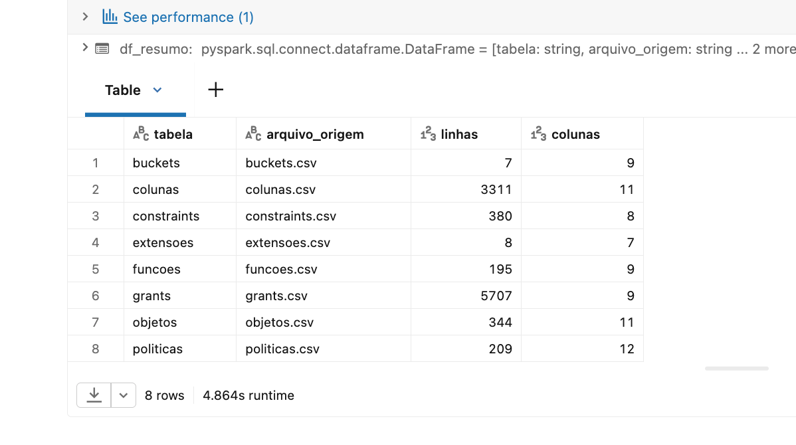

*Evidência de persistência: as oito tabelas Bronze e suas contagens*

---

## Modelagem e Catálogo de Dados (Etapa 4.3)

### Esquema estrela

```
                    dim_tempo
                        |
   dim_objeto ---- fato_achado ---- dim_regra
                    /      \
            dim_coluna     dim_role        dim_politica
```

**Granularidade do fato:** um achado de segurança — uma regra violada por um objeto
(opcionalmente por coluna ou role) em um snapshot.

Duas escolhas de modelagem que vale explicar:

**`dim_regra` é curada manualmente.** As 18 regras, sua severidade, seu peso numérico e sua
categoria no OWASP Top 10:2025 vivem como uma dimensão do modelo. Isso faz com que o
referencial de segurança seja consultável por SQL, em vez de existir apenas como prosa no
relatório — dá para perguntar "qual categoria do OWASP concentra meu risco?" com um
`GROUP BY`.

**Quatro das 18 regras são específicas de dado de saúde** (R15–R18). Elas existem porque o
Pitaia cai no art. 11 da LGPD: uma tabela de prontuário exposta não tem o mesmo peso que
uma tabela de configuração exposta, e o modelo precisa refletir isso. O `score_risco`
multiplica o peso da regra por 3 quando o achado atinge dado sensível.

### Camadas

| Camada | Schema | Tabelas |
|---|---|---|
| Bronze | `bronze` | 8 tabelas cruas |
| Silver | `silver` | `objeto`, `coluna`, `politica`, `grant_role`, `funcao`, `bucket`, `extensao`, `constraint_tabela`, `perfil_qualidade`, `perfil_duplicatas` |
| Gold | `gold` | `dim_objeto`, `dim_coluna`, `dim_politica`, `dim_role`, `dim_regra`, `dim_tempo`, `fato_achado`, `backlog_remediacao`, `postura_por_schema`, `mapa_exposicao_lgpd`, `isolamento_prontuario` |

### Catálogo de dados

Transcrito em [`docs/catalogo_de_dados.md`](docs/catalogo_de_dados.md) e aplicado no
**Unity Catalog** via `COMMENT ON TABLE` e `ALTER COLUMN … COMMENT` no notebook 03.


*Unity Catalog: descrição da tabela `gold.fato_achado`*


*Unity Catalog: descrição por coluna, incluindo o cálculo de `score_risco`*

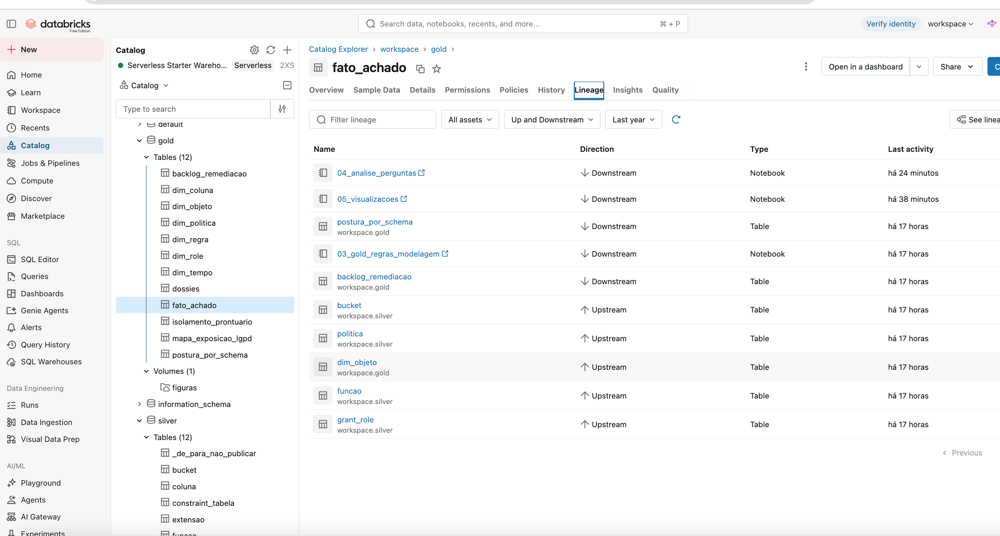

*Aba Lineage: o grafo Bronze → Silver → Gold, construído automaticamente*

---

## Pipeline de Dados (Etapa 4.4)

Ramificado em **cinco notebooks**, um por responsabilidade — não em um notebook único, para
que cada etapa possa ser reexecutada isoladamente quando algo precisa de ajuste.

| Notebook | Responsabilidade | Entrada → Saída |
|---|---|---|
| `01_bronze_ingestao.py` | Coleta | 8 CSVs → 8 tabelas Bronze |
| `02_silver_qualidade.py` | Perfil de qualidade, padronização, classificação LGPD | Bronze → 10 tabelas Silver |
| `03_gold_regras_modelagem.py` | Motor de 18 regras, estrela, catálogo | Silver → 11 tabelas Gold |
| `04_analise_perguntas.sql` | As 8 perguntas | Gold → resultados |
| `05_visualizacoes.py` | Figuras do relatório | Gold → PNGs no Volume `gold.figuras` |

### Transformações principais

| Transformação | O que foi feito | Por quê | Impacto |
|---|---|---|---|
| Explode de `roles` | `split(';')` + `explode` | `pg_policies.roles` é array; sem explodir não se consulta por role | 209 → 209 linhas (ver nota) |
| Normalização de booleanos | `t` / `true` / `1` → boolean | O export do Postgres é inconsistente entre colunas | Viabiliza filtro correto de RLS |
| Classificação LGPD | regex sobre nome de **tabela e coluna**, 15 classes | Liga estrutura do banco a risco regulatório | 301 de 1.238 colunas, das quais 210 de saúde |
| Flags de política | deriva `filtra_uid`, `filtra_tenant`, `libera_tudo` e descarta a expressão | Permite auditar isolamento sem publicar a estrutura de multi-tenancy | Todas as políticas |
| Anonimização | `t_001`, `c_<hash>`, estável e determinística | Repositório público, plataforma de saúde em produção | 100% dos identificadores |
| Motor de regras | 18 `SELECT` em `UNION ALL` sobre a Silver | Converte catálogo em achado acionável | 579 achados, score 2.704 |
| Score de risco | `peso × 3` (sensível), `× 2` (pessoal), `× 1` | Prioriza o que é regulatoriamente crítico | Ordena o backlog |


*`dim_regra`: as 18 regras com severidade e categoria OWASP*


*`backlog_remediacao`: achados ordenados por risco*

---

## Qualidade de Dados (Etapa 4.5)

Perfilamento feito **antes** de qualquer limpeza — medir depois não prova nada. Evidência em
`silver.perfil_qualidade` e `silver.perfil_duplicatas`.

| # | Problema detectado | Dimensão | Tratamento | Volume |
|---|---|---|---|---|
| 1 | `roles` como array serializado | Consistência | `split` + `explode` | 209 → 209 |
| 2 | `expressao_using` nula em políticas só com `WITH CHECK` | Completude | flag `so_check` + `coalesce`, em vez de descartar | 36 de 209 (17,2%) |
| 3 | Booleanos em formatos mistos | Consistência | normalização para boolean | todas as flags |
| 4 | Views presentes em `colunas` mas sem RLS aplicável | Acurácia | separação por `tipo_objeto`, regra própria (R07) | 3 views, 60 colunas |
| 5 | Grants duplicados por herança de role | Unicidade | `dropDuplicates` com contagem prévia | 3.826 linhas, **0 duplicatas** |
| 5b | 30 repetições em `funcoes` pela chave `(schema, nome)` | Unicidade | **não deduplicadas** — são overloads, ver nota | 195 linhas, 165 nomes distintos |
| 6 | Schemas do Supabase misturados aos da aplicação | Escopo | flag `dominio`, mantidos como comparação | 2 schemas / 79 objetos da aplicação vs 8 schemas / 54 objetos do Supabase |
| 7 | Falso positivo e falso negativo do classificador LGPD | Acurácia | amostra de 40 colunas rotulada à mão | precisão **80,0%** · recall **50,0%** |

**Sobre o item 1.** O explode não multiplicou linhas: cada política do Pitaia é concedida a
exatamente uma role, então 209 políticas produziram 209 pares política × role. A
transformação continua necessária — sem ela o campo `roles` é um texto não consultável — mas
o impacto em volume foi nulo. Registro porque o resultado esperado era outro.

**Sobre o item 5b — o achado que mudou a modelagem.** O perfil de duplicatas acusou 30
repetições em `funcoes` pela chave `(schema_nome, funcao)`. Investigadas, são **funções
sobrecarregadas** do PostgreSQL: mesmo nome, assinaturas distintas, cada uma com suas
próprias flags de segurança. A deduplicação ingênua, que era o que o pipeline fazia, teria
descartado 30 linhas — e se qualquer uma delas fosse `SECURITY DEFINER` sem `search_path`, a
regra R04 perderia o achado em silêncio. Falso negativo numa regra crítica é o pior
resultado possível numa auditoria: ela reporta segurança que não existe. A chave natural
correta dessa tabela não é o nome da função, e por isso ela deixou de ser deduplicada. É o
caso mais claro do trabalho em que **medir a qualidade dos dados corrigiu a modelagem**.

**Sobre o item 5.** A deduplicação não removeu nenhuma linha: a ACL lida de `pg_class.relacl`
já é única por tupla role × objeto × privilégio. A verificação foi executada e o resultado
negativo está documentado em `silver.perfil_duplicatas`, conforme o enunciado pede para bases
que se mostram limpas.

**Sobre o item 7.** Uma heurística sobre nomenclatura erra nos dois sentidos, e apresentá-la
como exata seria desonesto. Quarenta colunas dos schemas expostos foram amostradas por hash
estável — não por `rand()`, para que a amostra seja reproduzível — e rotuladas manualmente.

**O critério de rotulação precisa ser declarado**, porque ele determina o resultado. Adotei a
definição ampla do art. 5º, I da LGPD: *dado pessoal é toda informação relacionada a pessoa
identificada ou identificável*. Na prática, tudo que é informação do usuário conta — inclusive
identificadores como `user_id` e marcas de atividade como `created_at` de um registro dele —
**exceto o que o próprio usuário optou por tornar público**, que no Pitaia é o check-in de
treino compartilhado.

| | classificador diz que É | classificador diz que NÃO É |
|---|---|---|
| **é dado pessoal** | VP = 12 | FN = 12 |
| **não é** | FP = 3 | VN = 13 |

**Precisão 80,0% · Recall 50,0%.**

A assimetria é o achado. O classificador é **confiável quando acusa** — 4 em cada 5 acertos —
mas **encontra apenas metade** do que existe. Para uma auditoria de conformidade isso é a pior
combinação possível: um relatório baseado nele subestimaria sistematicamente a superfície de
dado pessoal, e o faria com aparência de precisão.

Os erros seguem três padrões distintos.

**Falsos negativos por nome neutro (o grupo maior).** `profiles.cycle_length_days` é duração do
ciclo menstrual — dado de saúde sensível pelo art. 5º, II — invisível porque nem `profiles` nem
o nome da coluna casam com padrão clínico. `patient_custom_field_values.value` é campo
customizado de paciente e pode conter qualquer coisa. `access_audit_events.device_id`
identifica o dispositivo. `email_send_log.metadata` é JSON que pode carregar destinatário. E
todos os `user_id`, `created_at` e `updated_at` de tabelas de conteúdo do usuário, que a
heurística trata como estrutura e a LGPD trata como informação relacionada a pessoa
identificável.

**Falsos positivos por herança de metadado.** `invite_links.link_type` e
`email_send_state.auth_email_ttl_minutes` são parâmetros de configuração que herdaram a classe
da tabela ou casaram com uma palavra isolada.

**O falso positivo mais interessante: `checkins.training_type`.** O classificador o marcou como
dado de saúde, e tecnicamente é. Mas é o campo do check-in de treino que o usuário
deliberadamente torna público no Pitaia. **Consentimento muda a classificação**, e nenhuma
heurística baseada em nome de coluna ou de tabela pode capturar isso — a informação sobre a
base legal não está no esquema, está na decisão do titular.

O padrão geral: **a heurística acerta onde o dado é estruturado e nomeado por convenção, e
falha nos três lugares em que a nomenclatura não carrega a informação relevante** — texto
livre, identificadores, e escolha do titular. É o limite de classificar dado pessoal por
esquema, e é a razão de o número ter sido medido em vez de assumido.

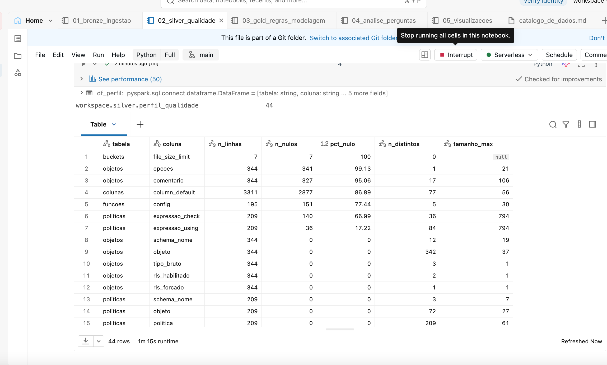

*Perfil de qualidade por atributo, medido na Bronze antes da limpeza*


*Duplicatas por chave natural — as 30 de `funcoes` são os overloads*

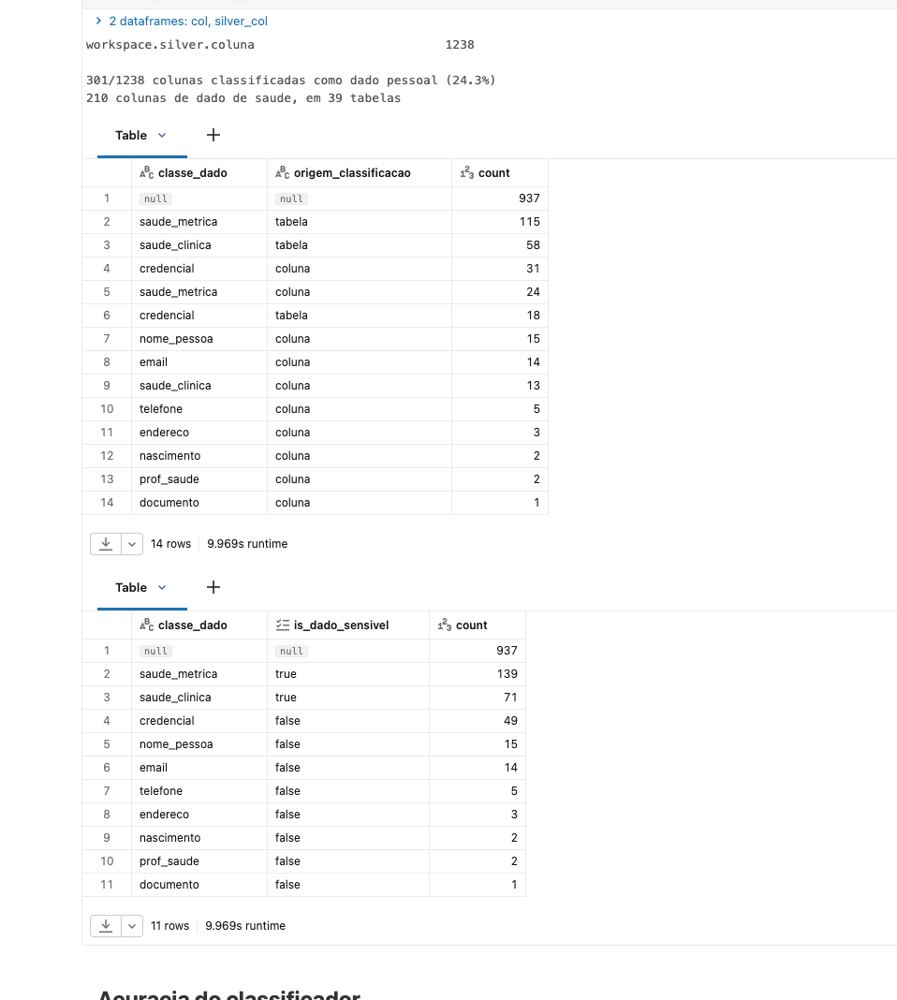

*Distribuição das classes de dado pessoal e origem da classificação*

---

## Análise de Dados (Etapa 4.5)

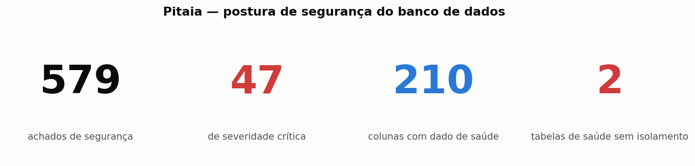

*Os quatro números que resumem a auditoria*

### P1 — Proporção de tabelas expostas sem RLS

**Resultado: 0%.** As 70 tabelas expostas via PostgREST têm Row Level Security habilitado,
sem exceção.

Vale notar que a consulta devolve **uma única linha**: nenhum schema gerenciado pelo Supabase
aparece como exposto via API, porque os schemas expostos configurados no projeto são apenas
`public` e `graphql_public`. O grupo de comparação, que aparece nas demais perguntas, não se
aplica aqui — e isso em si é informação: a superfície alcançável pela chave anônima é
exatamente o schema da aplicação, e nada além dele.

Este é o resultado mais importante do trabalho, e é positivo. A falha mais comum e mais grave
em projetos Supabase é a tabela esquecida sem RLS: como a chave anônima é pública por design
— ela vive embutida no front-end —, uma tabela sem política não é "menos protegida", é
aberta para qualquer pessoa que inspecione o bundle JavaScript. A ausência completa dessa
falha indica que habilitar RLS foi tratado como padrão do projeto, não como exceção lembrada
caso a caso. Reportar ausência de falha com número é tão válido quanto reportar falha, e é o
que separa uma auditoria de uma lista de reclamações.

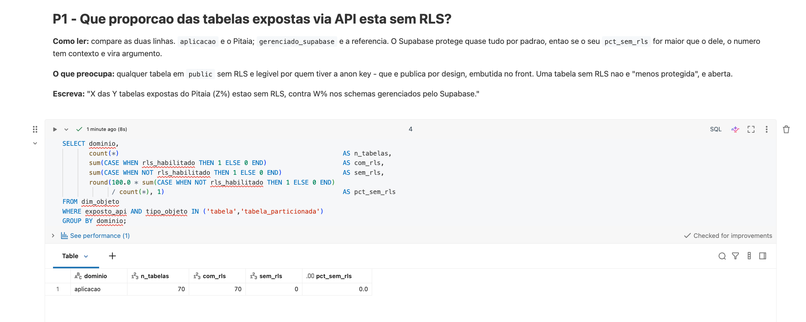

*Resultado da P1*

### P2 — RLS habilitado com zero políticas

**Resultado: 25 detectadas, mas apenas 1 na aplicação.**

| schema | domínio | tabelas |
|---|---|---|
| `auth` | gerenciado pelo Supabase | 16 |
| `storage` | gerenciado pelo Supabase | 7 |
| `realtime` | gerenciado pelo Supabase | 1 |
| **`public`** | **aplicação** | **1** |

No PostgreSQL, RLS habilitado sem nenhuma política **nega todo acesso**. É o inverso exato da
falha anterior: o defeito é de disponibilidade, não de confidencialidade. A tabela passa em
qualquer checklist que pergunte "RLS está ativo?" e devolve zero linhas para todo mundo.

**A distinção por domínio é o que salva a conclusão.** Nos schemas `auth` e `storage`, RLS sem
política é o comportamento **correto**: o acesso a essas tabelas se dá pelas APIs de
autenticação e de armazenamento do Supabase, usando a `service_role`, que contorna RLS por
definição. Bloquear o acesso via PostgREST é exatamente o que se espera ali. Sem o campo
`dominio` separando aplicação de plataforma, o relatório apontaria 25 defeitos onde existe 1 —
e os 24 falsos seriam defendidos com convicção, já que a regra os detectou corretamente.

A única tabela da aplicação nessa condição é um defeito real, e de um tipo específico: pelo
princípio de *fail-safe defaults*, um dos oito que Saltzer e Schroeder formularam em 1975, o
sistema falhou do lado certo — quebra funcionalidade, não vaza dado. O custo provável é uma
funcionalidade do Pitaia que não responde e cuja causa ninguém associou ao RLS.

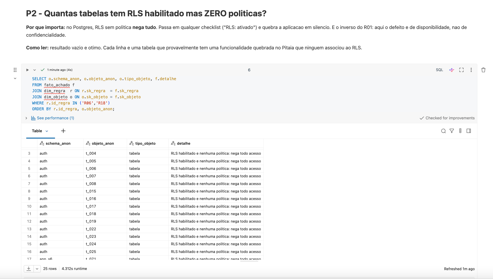

*Resultado da P2*

### P3 — Políticas com isolamento real

**Resultado: entre 88,6% e 100%, conforme a role e o comando.**

| role | comando | políticas | com isolamento | % |
|---|---|---|---|---|
| authenticated | SELECT | 41 | 37 | 90,2 |
| authenticated | ALL | 16 | 15 | 93,8 |
| authenticated | INSERT / UPDATE / DELETE | 43 | 43 | 100 |
| public | SELECT | 44 | 39 | 88,6 |
| public | ALL | 29 | 27 | 93,1 |
| public | INSERT / UPDATE / DELETE | 36 | 36 | 100 |

O padrão é nítido e revela algo sobre como o sistema foi construído: **as operações de
escrita estão universalmente isoladas; as de leitura não.** Todas as 43 políticas de
`INSERT`, `UPDATE` e `DELETE` para `authenticated` amarram a linha ao usuário. As falhas se
concentram em `SELECT` — 4 políticas em `authenticated` e 5 em `public` sem qualquer
referência a `auth.uid()`, ao JWT ou a coluna de tenant. Uma política de `SELECT` para
`authenticated` sem filtro significa que qualquer conta logada alcança as linhas de todas as
outras.

Há também **uma política `SELECT` com `USING(true)`** para `authenticated`, que concede
leitura irrestrita.

As 209 políticas distribuídas em 70 tabelas — cerca de três por tabela — formam uma
superfície que dificilmente alguém revisa por completo. Vale o princípio de *economia de
mecanismo*, também de Saltzer e Schroeder, e a formulação mais direta de Bruce Schneier: a
complexidade é o pior inimigo da segurança. Não é que cada política esteja errada; é que o
volume torna improvável que todas estejam certas.

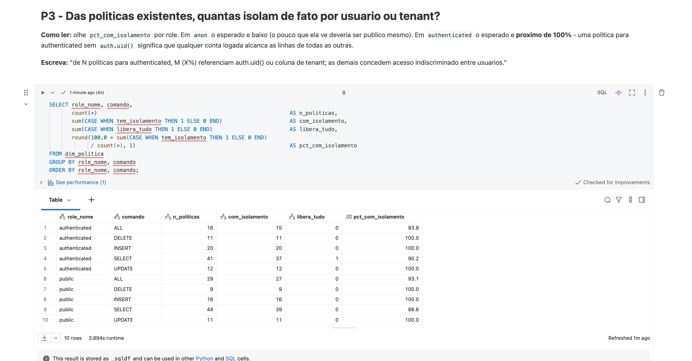

*Resultado da P3*

### P4 — Escrita disponível à role anônima

**Resultado: 294 achados de privilégio anônimo, dos quais 39 sobre tabelas com dado de saúde.**

Este número precisa ser lido com cuidado, e é onde o `score_ajustado` faz diferença. O
Supabase concede `GRANT` amplo a `anon` e `authenticated` **por padrão de arquitetura**, e
delega a proteção ao RLS. Esses 333 achados (R08 + R16) descrevem o modelo da plataforma, não
um defeito introduzido pela aplicação — por isso foram marcados como `esperado_por_design` e
removidos do score ajustado, sem serem descartados do modelo.

O que eles revelam continua sendo relevante, e é arquitetural: **o RLS é o único controle
entre a chave anônima e os dados.** Não há defesa em profundidade. Desabilitar RLS em
qualquer uma dessas tabelas, por qualquer motivo — uma migração, um debug, um ajuste
apressado — converte imediatamente 333 possibilidades em 333 vulnerabilidades, e 39 delas
atingiriam dado clínico.

Vale registrar que integridade é uma dimensão distinta de confidencialidade, na linha do
modelo de Clark e Wilson (1987). A maioria das auditorias examina apenas leitura indevida. Em
um sistema de saúde, escrita indevida permite inserir registro falso no prontuário de
alguém — e o impacto disso pode superar o de um vazamento.

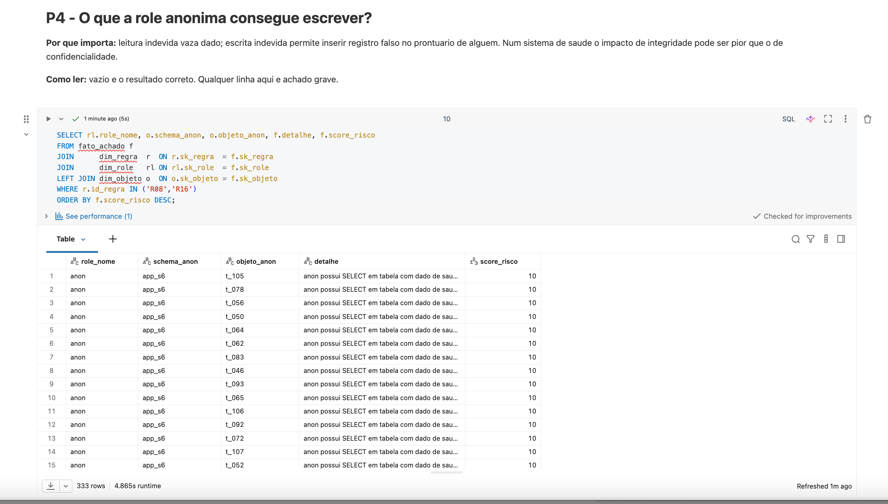

*Resultado da P4*

### P5 — Concentração de risco por schema

| schema | domínio | objetos | achados | score bruto | score ajustado | por objeto |
|---|---|---|---|---|---|---|
| `app_s6` | aplicação | 70 | 489 | 2.331 | **271** | 33,3 |
| `storage` | Supabase | 8 | 30 | 144 | 62 | 18,0 |
| `cron` | Supabase | 2 | 4 | 14 | 14 | 7,0 |
| `auth` | Supabase | 27 | 32 | 112 | 112 | 4,2 |
| `app_s5` | aplicação | 9 | 10 | 12 | 12 | 1,3 |

O contraste entre score bruto e ajustado no `app_s6` é o resultado mais instrutivo da tabela:
**2.331 caem para 271, uma redução de 88%.** Essa diferença é a medida exata de quanto do
"risco" aparente era característica da plataforma em vez de decisão da aplicação. Sem essa
separação, o relatório apontaria 489 achados no schema principal e enterraria os poucos que
realmente exigem ação.

Normalizado por objeto, `app_s6` ainda lidera (33,3), mas a comparação com os schemas
gerenciados pelo Supabase dá a escala correta: `auth`, mantido pela própria plataforma e
supostamente exemplar, registra 4,2 achados por objeto. A diferença é real, e não é
catastrófica.

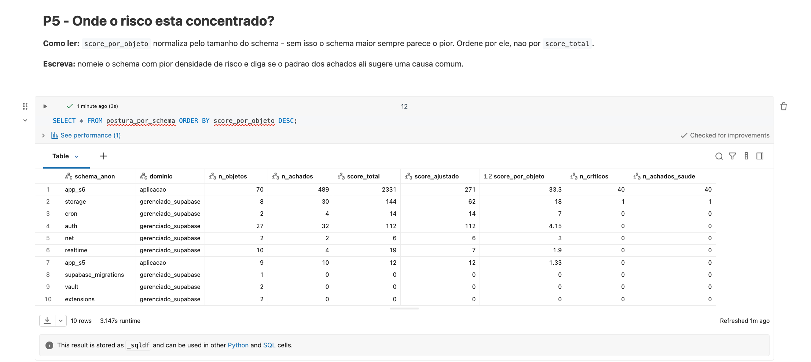

*Resultado da P5*

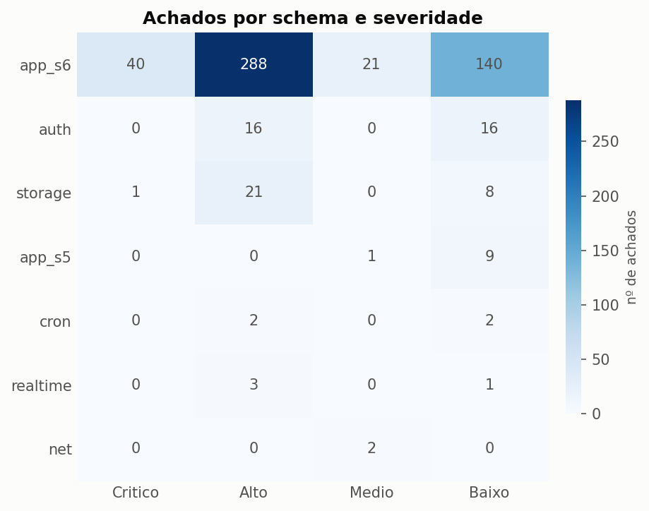

*Achados por schema e severidade*

### P6 — Distribuição pelo OWASP Top 10:2025

| categoria | achados | score | % do total |
|---|---|---|---|
| **A01 Broken Access Control** | 346 | 2.240 | 59,8% dos achados, **82,8% do score** |
| A02 Security Misconfiguration | 182 | 236 | 31,4% |
| A06 Insecure Design | 46 | 213 | 7,9% |
| A08 Software and Data Integrity Failures | 3 | 9 | 0,5% |
| A03 Software Supply Chain Failures | 2 | 6 | 0,3% |

A concentração em A01 era esperada e confirma o diagnóstico: o risco de uma aplicação
multi-tenant de saúde é, essencialmente, controle de acesso. Vale registrar duas mudanças da
edição 2025, publicada em janeiro de 2026 sobre a análise de mais de 175 mil CVEs: **A02
Security Misconfiguration subiu de #5 para #2**, porque má configuração passou a dominar os
dados — e os 182 achados de A02 aqui, ainda que de baixa severidade, ilustram isso na escala
de uma única aplicação. E **A03 Software Supply Chain Failures é categoria nova**; os dois
achados de extensão instalada fora do schema `extensions` caem exatamente nela.

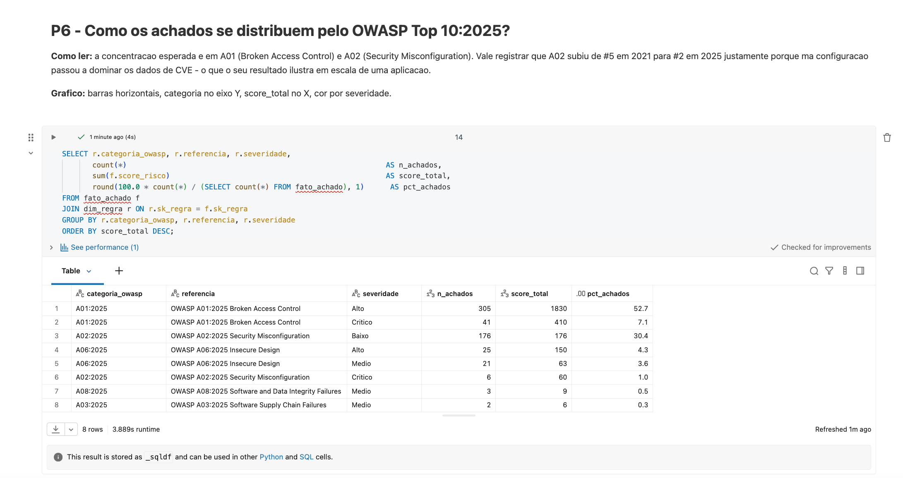

*Resultado da P6*

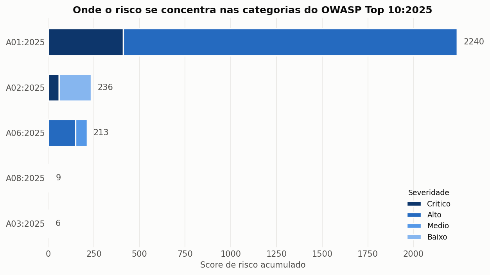

*Score de risco por categoria do OWASP Top 10:2025*

### P7 — Colunas com dado de saúde sem proteção

**Resultado: zero. 210 de 210 colunas de dado de saúde estão em tabelas com RLS.**

| classe | colunas | protegidas | expostas | % exposta |
|---|---|---|---|---|
| `saude_metrica` | 139 | 139 | 0 | 0,0 |
| `saude_clinica` | 70 | 70 | 0 | 0,0 |
| `credencial` | 22 | 22 | 0 | 0,0 |
| demais classes | 17 | 17 | 0 | 0,0 |

Em termos regulatórios: nenhuma coluna classificada como dado referente à saúde — categoria
que o art. 5º, II da LGPD trata como sensível e cujo tratamento o art. 11 condiciona a base
legal específica — está em tabela alcançável sem controle de linha. A obrigação do art. 46,
de adotar medidas de segurança proporcionais ao risco, está atendida no nível da
exposição direta.

É importante delimitar o que esse zero significa. Na taxonomia de privacidade de Daniel
Solove (2006), ele cobre **exposure** — a revelação direta. Não cobre **aggregation**: quantos
prontuários distintos um mesmo perfil consegue percorrer em sequência, ainda que cada acesso
individual seja legítimo. Essa dimensão não foi medida e permanece em aberto.

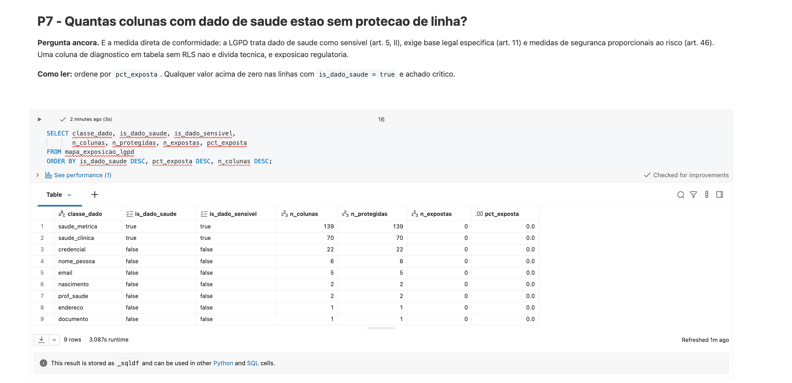

*Resultado da P7*

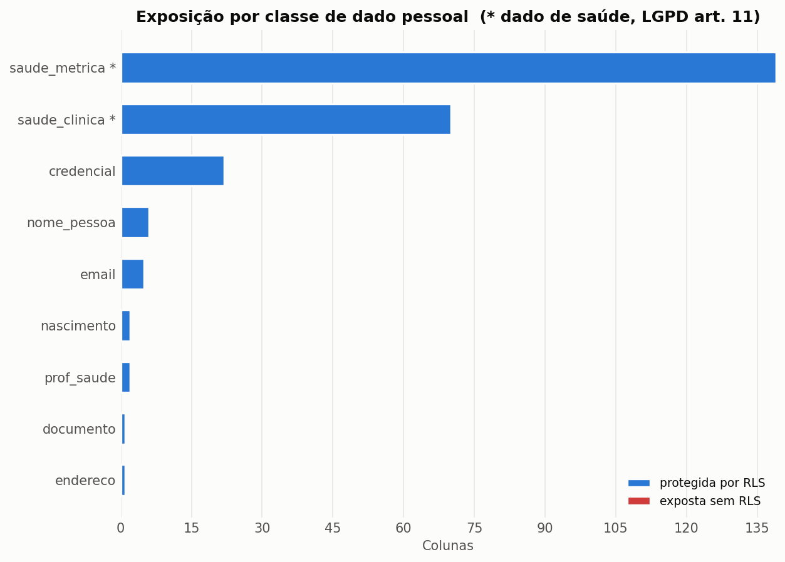

*Exposição por classe de dado pessoal — a ausência de barras vermelhas é o resultado*

### P8 — Isolamento de prontuário entre pacientes

**Resultado: 36 de 38 tabelas com dado de saúde estão corretamente isoladas. Duas não.**

| tabela | colunas de saúde | RLS | políticas | com isolamento | veredito |
|---|---|---|---|---|---|
| `t_105` | 3 | sim | 18 | 12 | **vazamento entre pacientes** |
| `t_088` | 1 | sim | 3 | 2 | **vazamento entre pacientes** |
| outras 36 | 1 a 21 | sim | 9 a 84 | todas | isoladas |

Nas duas tabelas existe política concedida a `authenticated` sem filtro por usuário ou
tenant. Na prática: qualquer conta autenticada do Pitaia alcança o dado clínico daquelas
tabelas para qualquer paciente. Note que ambas têm RLS habilitado e a maioria de suas
políticas corretamente isolada — `t_105` tem 12 de 18 — o que torna a falha invisível a
qualquer verificação binária do tipo "essa tabela tem RLS?".

Este é o achado central do trabalho, e a literatura sobre o tema é específica. Ross Anderson
escreveu em 1996 o modelo de política de segurança da British Medical Association para
sistemas de informação clínica, referência canônica sobre controle de acesso a prontuário.
Seu primeiro princípio é que **cada registro clínico carrega sua própria lista de controle de
acesso**. Nas duas tabelas, o controle degrada de "quem tem relação com este paciente" para
"qualquer conta autenticada". O modelo BMA prevê ainda notificação ao paciente sobre quem
acessou seu registro e controle de agregação — nenhum dos dois implementado na plataforma,
o que fica registrado em trabalhos futuros.

Há também uma leitura de **integridade contextual**, no sentido de Helen Nissenbaum (2010):
o dado carrega normas de fluxo ligadas ao contexto em que foi coletado. No Pitaia isso é
literal, porque existem três perfis distintos — paciente, médico e educador físico — e o que
faz sentido um médico ver não necessariamente faz sentido um educador físico ver. Não é uma
permissão binária, é uma norma de contexto, e políticas que não distinguem papel não
conseguem expressá-la.

**Limite desta análise, que precisa ser declarado.** A consulta demonstra o que o *banco*
permite, não o que a *aplicação* expõe. O front-end pode filtrar por conta própria. Mas
confiar nesse filtro contraria o princípio de **mediação completa** de Saltzer e Schroeder, e
é exatamente o que o RLS existe para tornar desnecessário: qualquer chamada direta ao
PostgREST com um JWT válido contorna o front-end inteiro. Na formulação do NIST SP 800-207
sobre Zero Trust, o ponto de aplicação de política precisa estar junto ao dado, não na
interface que o consome.

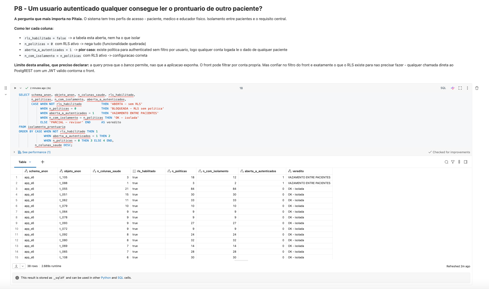

*Resultado da P8*

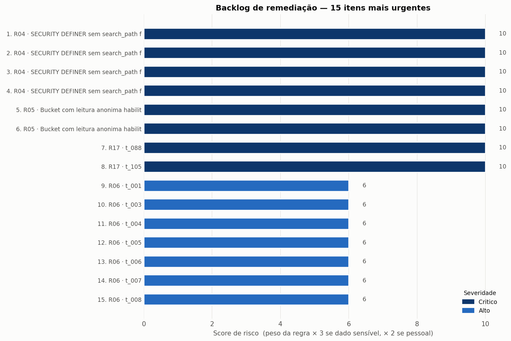

*Backlog de remediação: os oito defeitos reais no topo*

### Discussão geral

**O veredito.** A postura de segurança do Pitaia é substancialmente melhor do que a média de
aplicações construídas com geração assistida de código sobre Supabase. RLS habilitado em 100%
das tabelas expostas, 210 colunas de dado de saúde sem nenhuma exposição direta, e 36 das 38
tabelas clínicas com isolamento correto. Dos 579 achados brutos, **oito são defeitos reais
introduzidos pela aplicação**: 4 funções `SECURITY DEFINER` sem `search_path` fixado, 2
buckets de Storage públicos e 2 tabelas de saúde legíveis por qualquer conta autenticada.

**A causa raiz.** O padrão sugere uma assimetria consistente: habilitar RLS virou hábito
automático, escrever a política correta não. Daí 25 tabelas com RLS e nenhuma política, 9
políticas de `SELECT` sem isolamento e 100% das políticas de escrita corretas. Proteger
escrita é intuitivo — ninguém quer que outro usuário altere seus dados. Proteger leitura
exige pensar no cenário em que alguém *consulta* dado alheio, que é menos imediato e,
num sistema de saúde, mais grave.

**O que o backlog manda fazer, nesta ordem.** As 4 funções `SECURITY DEFINER` sem
`search_path` vêm primeiro: são vetor de escalada de privilégio, executam com o privilégio do
criador e contornam RLS inteiramente. Depois os 2 buckets públicos, verificando antes se
armazenam arquivos de paciente. Em terceiro, as 2 tabelas de saúde sem isolamento. As 25
tabelas com RLS e zero políticas entram em seguida, como correção de funcionalidade.

**O que a comparação contextualiza.** O schema da aplicação registra 33,3 pontos de risco por
objeto contra 4,2 do schema `auth`, mantido pela própria Supabase. A diferença é real, mas o
score ajustado mostra que 88% do risco bruto do `app_s6` vinha de grants que a plataforma
concede por padrão. Sem o grupo de comparação, qualquer número absoluto seria indefensável.

---

## Autoavaliação

### O que foi atingido

O ciclo completo do pipeline funcionou de ponta a ponta: oito fontes coletadas, três camadas
medalhão persistidas em Delta, esquema estrela com seis dimensões e uma fato de 579 registros,
catálogo documentado no Unity Catalog e as oito perguntas de negócio respondidas com dado.

Mais do que o pipeline, o objetivo declarado era transformar o catálogo de um banco em um
**backlog priorizado**, e isso foi alcançado: a `gold.backlog_remediacao` entrega uma ordem de
correção acionável, com os quatro achados de escalada de privilégio no topo. As duas perguntas
que mais importavam — quantas colunas de dado de saúde estão desprotegidas (P7) e se um
paciente alcança o prontuário de outro (P8) — foram respondidas de forma conclusiva.

### O que não foi atingido, e por quê

**Snapshot único.** A `dim_tempo` existe com uma linha só. Toda a arquitetura suporta série
histórica, mas não há histórico: não consigo afirmar se a postura melhorou ou piorou, apenas
descrevê-la num instante. Era a análise mais interessante disponível e ficou de fora por
tempo.

**A análise prova o que o banco permite, não o que a aplicação expõe.** As duas tabelas
apontadas na P8 podem estar protegidas por filtro no front-end. Não testei — isso exigiria
emitir JWTs de dois pacientes distintos e comparar o retorno. A análise estática mostra a
possibilidade, não o exercício dela. Por outro lado, é precisamente essa a razão de existir do
RLS: confiar no filtro da interface é o que o princípio de mediação completa proíbe.

**Classificação por nomenclatura, não por conteúdo.** O classificador lê nomes de tabela e de
coluna. Mediu-se **precisão de 80,0% e recall de 50,0%** numa amostra de 40 colunas rotuladas
manualmente sob a definição ampla do art. 5º, I. A assimetria é o problema: ele é confiável
quando acusa, mas encontra metade do que existe. Os erros se concentram em três lugares onde
o nome não carrega a informação — texto livre, identificadores, e dado que o titular optou por
tornar público. Uma classificação por amostragem de conteúdo seria mais precisa e é um projeto
em si.

**Coleta não automatizada.** Decisão consciente, explicada na seção de Carga, mas ainda assim
uma limitação: o pipeline não roda sozinho amanhã.

### Dificuldades encontradas

A maior não foi técnica, foi de escopo. O tema deste MVP mudou três vezes antes de
estabilizar, e as duas primeiras ideias falhavam pelo mesmo motivo: eu partia de um dado
interessante em vez de partir de uma pergunta. Quando o ponto de partida virou *"o que eu
preciso decidir?"*, o resto — fonte, modelo, análise — se ordenou sozinho. É exatamente o que
o enunciado adverte na etapa de objetivo, e eu precisei errar duas vezes para entender.

Tecnicamente, três problemas tomaram tempo real. O mais instrutivo foi o do
`information_schema`: uma consulta correta em sintaxe, executada sem erro, devolvendo dados
incompletos por causa de uma regra de visibilidade que eu não conhecia. Descobri porque as
contagens não bateram entre a tela e o arquivo — sem essa conferência, teria concluído que a
aplicação não tinha nenhum problema de privilégio anônimo.

O segundo foi o dos *overloads*: o perfil de duplicatas acusou 30 repetições em `funcoes` e
meu pipeline as descartava. Eram assinaturas distintas da mesma função, cada uma com suas
próprias flags de segurança. A deduplicação ingênua poderia ter escondido uma função
`SECURITY DEFINER` vulnerável — falso negativo numa regra crítica, que é o pior desfecho
possível de uma auditoria, porque afirma uma segurança que não existe. Foi o momento em que
**medir a qualidade dos dados corrigiu a modelagem**, e não o contrário.

O terceiro foi menos dramático e igualmente útil: `input_file_name()` bloqueada pelo Unity
Catalog e aspas simples quebrando `COMMENT`. Ambos são atritos que só existem dentro de um
ambiente governado, e que não aparecem rodando Spark solto.

### Trabalhos futuros

- **Lakehouse Federation** com *foreign catalog* PostgreSQL e credencial em Databricks
  Secrets, substituindo a exportação manual e permitindo execução agendada.
- **Série temporal de snapshots**, transformando `dim_tempo` de uma linha num eixo real e
  permitindo medir a evolução da postura após a remediação.
- **Teste ativo de isolamento**: emitir JWTs de dois pacientes distintos e confirmar
  empiricamente o que a P8 aponta estaticamente.
- **Controle de agregação**, no sentido do modelo BMA de Anderson: medir quantos prontuários
  distintos um mesmo perfil alcança em sequência. A P7 cobre exposição direta; agregação é a
  dimensão que fica descoberta.
- **Classificação de dado de saúde por conteúdo** (amostragem com NER clínico) em vez de
  nomenclatura, elevando precisão e recall.
- **Regras de MCP** na `dim_regra` — *tool poisoning*, *confused deputy*, *token passthrough* —
  relevantes porque a plataforma expõe interface MCP e essa superfície não foi auditada.

---

## Governança e Anonimização

Ver [`docs/governanca_anonimizacao.md`](docs/governanca_anonimizacao.md).

Este repositório é público e o Pitaia está em produção com prontuário de pessoas reais.
Publicar o nome de uma tabela vulnerável seria distribuir o caminho pronto. Por isso todos
os identificadores foram anonimizados, nenhum dado de paciente foi ingerido, nenhuma
credencial trafegou para fora do Supabase e nenhuma expressão de política foi publicada. As
conclusões são estatísticas e não dependem dos nomes reais: *"X% das colunas de dado de
saúde estão em tabelas sem RLS"* tem o mesmo valor informativo com `t_007` ou com o nome
verdadeiro.
